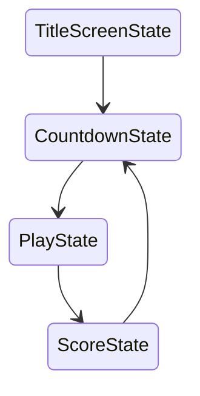

# bird-7: collision
pretty much the same to Pong

```lua
--! file: main.lua
...
local scrolling = true  -- for stop scrolling when we pause the game
...
function love.update(dt)
	if scrolling then
		-- all the update logic here
		...
		for k, pair in pairs(pipePairs) do
			pair:update(dt)
			for l, pipe in pairs(pair.pipes) do
				if bird:collides(pipe) then
					-- stop scrolling when the bird collides with any pipe
					scrolling = false
				end
			end
			...
		end
		...
	end
	-- reset input table
	love.keyboard.keysPressed = {}
end
...
```

```lua
--! file: Bird.lua
...
function Bird:collides(pipe)
	-- just AABB collision detection
	if (self.x + 2) + (self.width - 4) >= pipe.x and self.x + 2 <= pipe.x + PIPE_WIDTH then
		if (self.y + 2) + (self.height - 4) >= pipe.y and self.y + 2 <= pipe.y + PIPE_HEIGHT then
			return true
		end
	end
	
	return false
end
...
```

`(self.x + 2) + (self.width - 4)`
* why not just `self.x + self.width`? what it does?
* shrinking the box a little bit
	* then why `self.x + 2` but `self.width - 4`? not `self.width - 2`?
	* `(self.x + 2) + (self.width - 2)` would shrink the left side of the box but not the right side
		* if you can't quite understand, think about how `self.x + self.width` looks
* so it's a bit more fair, than pixel perfect collision detection
	* it's a little bit harder to collide
	* players get less frustration

* a little common trick
* makes the game feel more forgiving
	* less frustration, more fun

if we want the bird to be able to check collision against anything, we shouldn't use `PIPE_WIDTH` and `PIPE_HEIGHT` at all, but `pipe.width` and `pipe.height`
* also it's better to have a different name for `pipe` in that case, maybe `entity`

if we want it to be more scalable, we should have a function like `collides(a, b)`
* `a`, `b` are just any 2 things that we known have bounding boxes
* probably not placed in the `Bird` class, but maybe `main.lua` or some manager script

in this game, we don't have to worry about them
* the bird can either collide with the pipes or the ground
* for the ground its collision detection is simply checking if the bird's y is lower than some value
___

# bird-8: State Machine

now we want to have scoring
and if we have scoring, what are the different states of the game that we would also want
1. a screen that tells us when we lost, and what our score was
2. a title screen would be nice, so we don't jump right into the gameplay
	* also a count down screen so that we know our game is about to start after the title screen
3. a screen that lets us play the actual game



```lua
--! file: main.lua
...
require 'StateMachine'
require 'states/BaseState'
require 'states/PlayState'
require 'states/TitleScreenState'
...
function love.load()
	...
	smallFont = love.graphics.newFont('font.ttf', 8)
	mediumFont = love.graphics.newFont('flappy.ttf', 14)
	flappyFont = love.graphics.newFont('flappy.ttf', 28)
	hugeFont = love.graphics.newFont('flappy.ttf', 56)
	love.graphics.setFont(flappyFont)
	...
	-- it's common to prefix global variable with a lower case g
	-- also lower case m for member, which means it's a function or field of a class
	gStateMachine = StateMachine {
		['title'] = function() return TitleScreenState() end,
		['play'] = function() return PlayState() end
	}
	gStateMachine:change('title')
	
	love.keyboard.keysPressed = {}
end
...
function love.update(dt)
	-- code for scrolling the parallax background and foreground
	--[[this is a global feature in our game, they scroll no matter the state
		so we keep it in main]]
	...
	
	-- we defer the update to the state machine, then defer to the current state
	-- so we're not doing if this then that kind of state logic any more
	gStateMachine:update(dt)
	
	love.keyboard.keysPressed = {}
end

function love.draw()
	push:start()
	
	love.graphics.draw(background, -backgroundScroll, 0)
	gStateMachine:render() -- we also defer the draw function
	love.graphics.draw(ground, -groundScroll, VIRTUAL_HEIGHT - 16)
	
	push:finish()
end
```

`gStateMachine = StateMachine {...}`
* so `StateMachine` is a table
	* with keys that maps to functions that will return our states

`gStateMachine:change('title')`
* we call this function to change the state of the game
* in this case it'll trigger the function `TitleScreenState()`

```lua
--! StateMachine.lua
-- surprisingly it's not a complex one, very clean code and logic
-- from the book How To Make An RPG
StateMachine = Class{}

function StateMachine:init(states)
	-- so a states are basically a set of functions
	self.empty = {
		render = function() end,
		update = function() end,
		enter = function() end,
		exit = function() end
	}
	self.states = states or {} -- if `states` isn't provided, assign it to `{}` instead
	self.current = self.empty
end

function StateMachine:change(stateName, enterParams)
	assert(self.states[stateName])          -- prepare for changing state
	self.current:exit()
	self.current = self.states[stateName]()
	self.current:enter(enterParams)
end

function StateMachine:update(dt)
	self.current:update(dt)
end

function StateMachine:render()
	self.current:render()
end
```

`self.current:exit()`
* we must exit the last state
* maybe it needs to de-allocate some memory

```lua
--! file: BaseState.lua
BaseState = Class{}

function BaseState:init() end
function BaseState:enter() end
function BaseState:exit() end
function BaseState:update(dt) end
function BaseState:render() end
```

`BaseState` is just an empty class or empty state
* our states will inherit this state
* so that we don't need to define all the `init()`, `enter()`, `exit()`, ..., functions in our states
	* if we havn't define it, it just use this empty ones from `BaseState`

```lua
--! file: TitleScreenState.lua
TitleScreenState = Class{__includes = BaseState} -- hump.class way to do inheritance
-- just including everything from BaseState

function TitleScreenState:update(dt)
	if love.keyboard.wasPressed('enter') or love.keyboard.wasPressed('return') then
		gStateMachine:change('play')
	end
end

function TitleScreenState:render()
	love.graphics.setFont(flappyFont)
	love.graphics.printf('Fifty Bird', 0, 64, VIRTUAL_WIDTH, 'center')
	
	love.graphics.setFont(mediumFont)
	love.graphics.printf('Press Enter', 0, 100, VIRTUAL_WIDTH, 'center')
end
```

finally the `PlayState.lua` basically is all the code that we used to put in `main.lua`
___

## bird-9: score

```lua
--! file: main.lua
...
require 'StateMachine'
require 'states/BaseState'
require 'states/PlayState'
require 'states/ScoreState' -- added this
require 'states/TitleScreenState'
...
function love.load()
	...
	gStateMachine = StateMachine {
		['title'] = function() return TitleScreenState() end,
		['play'] = function() return PlayState() end,
		['score'] = function() return ScoreState() end
	}
	gStateMachine:change('title')
	
	love.keyboard.keysPressed = {}
end
...
```

```lua
--! file: PipePair.lua
...
function PipePair:init(y)
	...
	self.scored = false
end
...
```

```lua
--! file: PlayState.lua
...
function PlayState:init()
	...
	self.score = 0
	
	self.lastY = -PIPE_HEIGHT + math.random(80) + 20
end

function PlayState:update(dt)
	...
	for k, pair in pairs(self.pipePairs) do
		if not pair.scored then
			-- for pipe pair that was already scored, we don't want to score again
			if pair.x + PIPE_WIDTH < self.bird.x then
				-- our bird.x is beyond the right edge of the pipe pair
				self.score = self.score + 1
				pair.scored = true
			end
		end
		pair:update(dt)
	end
	
	self.bird:update(dt)
	
	for k, pair in pairs(self.pipePairs) do
		for l, pipe in pairs(pair.pipes) do
			if self.bird:collides(pipe) then
				-- remember we can pass in enterParams when we call change()
				gStateMachine:change('score', {
					score = self.score
				})
			end
		end
	end
	
	if self.bird.y > VIRTUAL_HEIGHT - 15 then
		gStateMachine:change('score', {
			score = self.score
		})
	end
end

function PlayState:render()
	...
	love.graphics.setFont(flappyFont)
	love.graphics.print('Score: ' .. tostring(self.score), 8, 8)
	...
end
```

```lua
--! file: ScoreState.lua
ScoreState = Class{__includes = BaseState}

function ScoreState:enter(params)
	self.score = params.score
end

function ScoreState:update(dt)
	if love.keyboard.wasPressed('enter') or love.keyboard.wasPressed('return')
		gStateMachine:change('play')
	end
end

function ScoreState:render()
	love.graphics.setFont(flappyFont)
	love.graphics.printf('Oof! You lost!', 0, 64, VIRTUAL_WIDTH, 'center')
	
	love.graphics.setFont(mediumFont)
	love.graphics.printf('Score: ' .. tostring(self.score), 0, 100, VIRTUAL_WIDTH, 'center')
	
	love.graphics.printf('Press Enter to Play Again!', 0, 160, VIRTUAL_WIDTH, 'center')
end
```
___

## bird-10: count down

```lua
--! file: main.lua
...
require 'StateMachine'
require 'states/BaseState'
require 'states/CountDownState' -- added this
require 'states/PlayState'
require 'states/ScoreState'
require 'states/TitleScreenState'
...
function love.load()
	...
	gStateMachine = StateMachine {
		['title'] = function() return TitleScreenState() end,
		['countdown'] = function() return CountdownState() end,
		['play'] = function() return PlayState() end,
		['score'] = function() return ScoreState() end
	}
	...
end
```

```lua
--! file: CountdownState.lua
CountdownState = Class{__includes = BaseState}

COUNTDOWN_TIME = 0.75 -- 1 second is a little long, so we made it shorter

function CountdownState:init()
	self.count = 3
	self.timer = 0
end

function CountdownState:update(dt)
	self.timer = self.timer + dt
	
	if self.timer > COUNTDOWN_TIME then
		self.timer = self.timer % COUNTDOWN_TIME
		self.count = self.count - 1
		
		if self.count == 0 then
			gStateMachine:change('play')
		end
	end
end

function CountdownState:render()
	love.graphics.setFont(hugeFont)
	love.graphics.printf(tostring(self.count), 0, 120, VIRTUAL_WIDTH, 'center')
end
```

```lua
--! file: TitleScreenState.lua
...
function TitleScreenState:update(dt)
	if love.keyboard.wasPressed('enter') or love.keyboard.wasPressed('return')
		-- in title screen, we press enter to jump into
		-- the countdown state, instead of the play state
		gStateMachine:change('countdown')
	end
end
...
```
___

# bird-11: audio

```lua
--! file: main.lua
...
function love.load()
	...
	sounds = {
		-- made in bfxr
		['jump'] = love.audio.newSource('jump.wav', 'static'),
		['explosion'] = love.audio.newSource('explosion.wav', 'static'),
		['hurt'] = love.audio.newSource('hurt.wav', 'static'),
		['score'] = love.audio.newSource('score.wav', 'static'),
		-- https://freesound.org/people/xsgianni/sounds/388079/
		['music'] = love.audio.newSource('marios_way.mp3', 'static')
	}
	-- kick off music
	-- for our game, it's global
	sounds['music']:setLooping(true)
	sounds['music']:play()
	...
end
```

```lua
--! file: Bird.lua
...
function Bird:update(dt)
	self.dy = self.dy + GRAVITY * dt
	
	if love.keyboard.wasPressed('space') then
		self.dy = -5
		sounds['jump']:play()
	end
	
	self.y = self.y + self.dy
end
...
```

```lua
--! file: PlayState.lua
...
function PlayState:update(dt)
	...
	for k, pair in pairs(self.pipePairs) do
		if not pair.scored then
			if pair.x + PIPE_WIDTH < self.bird.x then
				self.score = self.score + 1
				pair.scored = true
				sounds['score']:play()
			end
		end
		pair:update(dt)
	end
	
	for k, pair in pairs(self.pipePairs) do
		for l, pipe in pairs(pair.pipes) do
			if self.bird:collides(pipe) then
				-- it's common to layer multiple sounds on top of each other
				-- one sound often isn't enough
				sounds['explosion']:play()
				sounds['hurt']:play()
				
				gStateMachine:change('score', {
					score = self.score
				})
			end
		end
	end
	
	self.bird:update(dt)
	
	if self.bird.y > VIRTUAL_HEIGHT - 15 then
		sounds['explosion']:play()
		sounds['hurt']:play()
		
		gStateMachine:change('score', {
			score = self.score
		})
	end
end
...
```
___

# bird-12: mouse input
since the original Flappy Bird was an iOS game

`love.mousepressed(x, y, button)`
* callback fired by LÖVE2D every time a mouse button is pressed
* returns the x, y position where the mouse cursor was at the time of the button press
___
