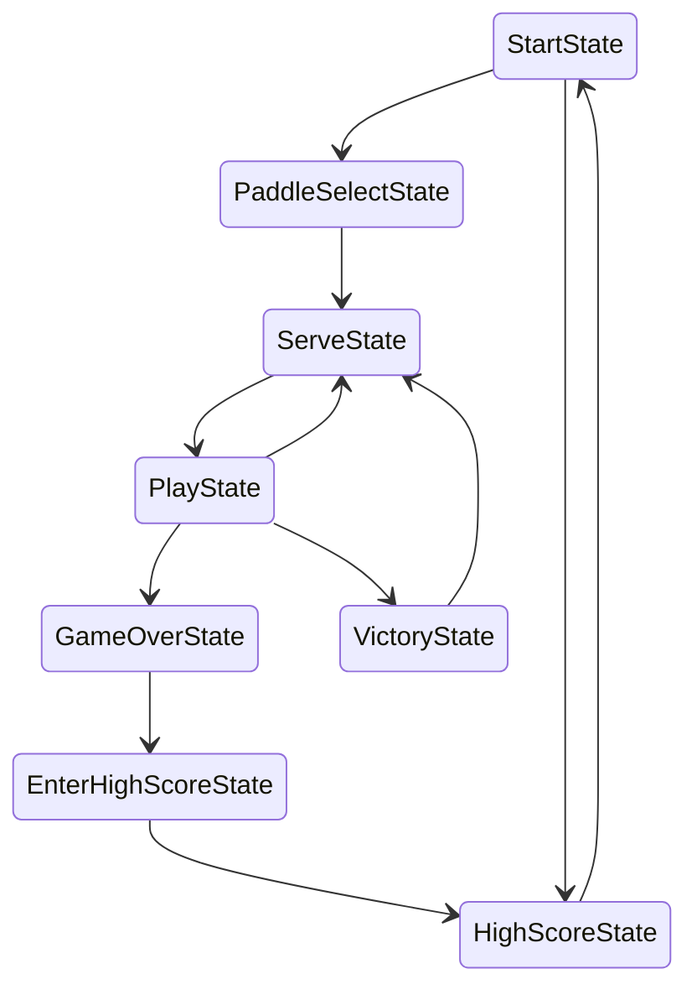

fun fact:
breakout used to be in [cs50x](https://cdn.cs50.net/2015/x/psets/3/pset3/pset3.html)
___

# State Flow


___

# breakout-0: organization

games like these starting to get to a rather large scale
* so structure the project folder well!
* don't put everything in the root folder

```
breakout
	fonts/
	graphics/
	lib/
	main.lua
	sounds/
	src/
```

we now have a file for storing constant values
```lua
--! file: src/constants.lua
WINDOW_WIDTH = 1280
WINDOW_HEIGHT = 720

VIRTUAL_WIDTH = 432
VIRTUAL_HEIGHT = 243
```

similarly a file for all the libraries, or *dependencies*
```lua
--! file: src/Dependencies.lua
push = require 'lib/push'

Class = require 'lib/class'

require 'src/constants'

require 'src/StateMachine'
require 'src/states/BaseState'
require 'src/states/StartState'
```

```lua
--! file: main.lua
require 'src/Dependencies'

function love.load()
	-- configurations
	...
	
	-- global variables
	gFonts = {
		['small'] = love.graphics.newFont('fonts/font.ttf', 8),
		['medium'] = love.graphics.newFont('fonts/font.ttf', 16),
		['large'] = love.graphics.newFont('fonts/font.ttf', 32)
	}
	love.graphics.setFont(gFonts['small'])
	
	gTextures = {
		['background'] = love.graphics.newImage('graphics/background.png'),
		['main'] = love.graphics.newImage('graphics/breakout.png'), -- a sprite sheet
		['arrows'] = love.graphics.newImage('graphics/arrows.png'),
		['hearts'] = love.graphics.newImage('graphics/hearts.png'),
		['particle'] = love.graphics.newImage('graphics/particle.png')
	}
	
	-- constants here have been moved out to src/constants.lua
	push:setupScreen(VIRTUAL_WIDTH, VIRTUAL_HEIGHT, WINDOW_WIDTH, WINDOW_HEIGHT, {
		vsync = true,
		fullscreen = false,
		resizable = true
	})
	
	gSounds = {
		['paddle-hit'] = love.audio.newSource('sounds/paddle_hit.wav'),
		['score'] = love.audio.newSource('sounds/score.wav'),
		['wall-hit'] = love.audio.newSource('sounds/wall-hit.wav'),
		['confirm'] = love.audio.newSource('sounds/confirm.wav'),
		['select'] = love.audio.newSource('sounds/select.wav'),
		['no-select'] = love.audio.newSource('sounds/no-select.wav'),
		['brick-hit-1'] = love.audio.newSource('sounds/brick-hit-1.wav'),
		['brick-hit-2'] = love.audio.newSource('sounds/brick-hit-2.wav'),
		['hurt'] = love.audio.newSource('sounds/hurt.wav'),
		['victory'] = love.audio.newSource('sounds/victory.wav'),
		['recover'] = love.audio.newSource('sounds/recover.wav'),
		['high-score'] = love.audio.newSource('sounds/high-score.wav'),
		['pause'] = love.audio.newSource('sounds/pause.wav'),
		
		['music'] = love.audio.newSource('sounds/music.wav')
	}
	
	-- state machine
	gStateMachine = StateMachine {
		['start'] = function() return StartState() end
	}
	gStateMachine:chnage('start')
	
	love.keyboard.keysPressed = {}
end

function love.resize(w, h)
	push:resize(w, h)
end

function love.update(dt)
	gStateMachine:update(dt)
	love.keyboard.keysPressed = {}
end

function love.keypressed(key)
	love.keyboard.keysPressed[key] = true
end

function love.keyboard.wasPressed(key)
	if love.keyboard.keysPressed[key] then
		return true
	else
		return false
	end
end

function love.draw()
	push:apply('start')
	
	local backgroundWidth = gTextures['background']:getWidth()
	local backgroundHeight = gTextures['background']:getHeight()
	
	-- background is global, so drew in main.lua
	love.graphics.draw(gTextures['background'],
		0, 0, -- position
		0,    -- rotation
		-- scale
		-- this background is smaller than VIRTUAL_WIDTH and _HEIGHT, so we scale it up
		VIRTUAL_WIDTH / (backgroundWidth - 1), VIRTUAL_HEIGHT / (backgroundHeight - 1))
	
	gStateMachine:render()
	
	displayFPS() -- standard practice in a lot of games
	push:apply('finish')
end

function displayFPS()
	love.graphics.setFont(gFonts['small'])
	love.graphics.setColor(0, 255, 0, 255)
	love.graphics.print('FPS: ' .. tostring(love.timer.getFPS()), 5, 5)
end
```

```lua
--! file: src/states/StartState.lua
StartState = Class{__includes = BaseState}

-- highlight the options in the start menu, so players know which they're selecting
local highlighted = 1

function StartState:update(dt)
	if love.keyboard.wasPressed('up') or love.keyboard.wasPressed('down') then
		-- since we only have 2 options in this example, it just flip between 1 and 2
		highlighted = highlighted == 1 and 2 or 1
		gSounds['paddle-hit']:play()
	end
	
	if love.keyboard.wasPressed('escape') then
		love.event.quit()
	end
end

function StartState:render()
	-- title
	love.graphics.setFont(gFonts['large'])
	love.graphics.printf("BREAKOUT", 0, VIRTUAL_HEIGHT / 3, VIRTUAL_WIDTH, 'center')
	
	-- instructions / options
	love.graphics.setFont(gFonts['medium'])
	
	if highlighted == 1 then
		love.graphics.setColor(103, 255, 255, 255)
	end
	love.graphics.printf("START", 0, VIRTUAL_HEIGHT / 2 + 70, VIRTUAL_WIDTH, 'center')
	
	-- remember to reset color
	love.graphics.setColor(255, 255, 255, 255)
	
	if highlighted == 2 then
		love.graphics.setColor(103, 255, 255, 255)
	end
	love.graphics.printf("HIGH SCORES", 0, VIRTUAL_HEIGHT / 2 + 90, VIRTUAL_WIDTH, 'center')
	
	-- again, remember to reset color
	love.graphics.setColor(255, 255, 255, 255)
end
```

since we only have 2 options in this example, `highlighted` can only goes either 1 or 2
if we have more options in the start menu, we should keep incrementing `highlighted` like
* `1` for start, `2` for high score, `3` for settings, `4` for exit, etc.
* until at some point flip back to `1`
	* same goes for keep decrementing and flip back to the bottom of the list
___

# breakout-1: sprite sheet

1. sprite sheet, ultimately, is just many images in one file
	* rather than have seperate files, each storing an image
![[breakout-sprite-sheet.png|300]]

2. and then we use rectangles to define where the different sprites are
![[breakout-quads.png|300]]

3. when we draw the image, we tell `love.graphics.draw()` to draw the image
	* but only this section of it
	* we do so by passing in a quad, which is just a rectangle, `x, y, width, height`

`love.graphics.newQuad(x, y, width, height, dimensions)`
* specify rectangle boundaries of the quad
* images have a function, `getDimensions()`

`love.graphics.draw(texture, quad, x, y)`
* variant of `love.graphics.draw()`
* this time it takes a `quad`

```lua
--! file: src/Util.lua
-- [[ this script contains the code for generating quads for a given sprite sheet ]]

function GenerateQuads(atlas, tilewidth, tileheight)
	-- divide the sprite atlas up, based on the size of the tiles
	local sheetWidth = atlas:getWidth() / tilewidth
	local sheetHeight = atlas:getHeight() / tileheight
	
	local sheetCounter = 1
	local spritesheet = {} -- holds all the quads
	
	-- a nested for loop
	for y = 0, sheetHeight - 1 do    -- starting from the top
		for x = 0, sheetWidth - 1 do -- starting from the left
			spritesheet[sheetCounter] =
				love.graphics.newQuad(x * tilewidth, y * tileheight, tilewidth,
				tileheight, atlas:getDimensions())
			sheetCounter = sheetCounter + 1
		end
	end
	
	return spritesheet
end

-- [[ Lua doesn't have a slice function for tables, so we add to it ]]
-- basically just the same as Python's list slicing
function table.slice(tbl, first, last, step)
	local sliced = {}
	
	for i = first or 1, last or #tbl, step or 1 do
		sliced[#sliced+1] = tbl[i]
	end
	
	return sliced
end

function GenerateQuadsPaddles(atlas)
	-- given the sprite sheet structure, we know how we should iterate through the sheet
	
	-- we are only interested in the middle of the sheet, so we'd start from there
	local x = 0
	local y = 64
	
	local counter = 1
	local quads = {}
	
	for i = 0, 3 do
		-- small paddle
		quads[counter] = love.graphics.newQuad(x, y, 32, 16, atlas:getDimensions())
		counter = counter + 1
		-- medium paddle
		quads[counter] = love.graphics.newQuad(x + 32, y, 64, 16, atlas:getDimensions())
		counter = counter + 1
		-- large paddle
		quads[counter] = love.graphics.newQuad(x + 96, y, 96, 16, atlas:getDimensions())
		counter = counter + 1
		-- huge paddle
		quads[counter] = love.graphics.newQuad(x, y + 16, 128, 16,
			atlas:getDimensions())
		counter = counter + 1
		
		-- go to the next section
		x = 0
		y = y + 32
	end
	
	return quads
end
```

```lua
--! file: main.lua
...
function love.load()
	...
	gFrames = {
		['paddles'] = GenerateQuadsPaddles(gTextures['main'])
	}
	...
end
```

from now on we can use `love.graphics.draw(gTextures['main'], gFrames['paddles'][1], x, y)` to draw the paddle
* and this is how `gFrames['paddles']` looks like in code

| color / size | small | medium | large | huge |
| --- | :-: | :-: | :-: | :-: |
| blue | 1 | 2 | 3 | 4 |
| green | 5 | 6 | 7 | 8 |
| red | 9 | 10 | 11 | 12 |
| purple | 13 | 14 | 15 | 16 |

```lua
--! file: src/Paddle.lua
Paddle = Class{}

function Paddle:init()
	self.x = VIRTUAL_WIDTH / 2 - 32
	self.y = VIRTUAL_HEIGHT - 32
	
	self.dx = 0
	
	self.width = 64
	self.height = 16
	
	-- we can multiply size by skin, to get the quad we need
	-- in order to draw the paddle image we need
	self.skin = 1
	self.size = 2
end

function Paddle:update(dt)
	if love.keyboard.isDown('left') then
		self.dx = -PADDLE_SPEED
	elseif love.keyboard.isDown('right') then
		self.dx = PADDLE_SPEED
	else
		self.dx = 0
	end
	
	-- clamp self.x
	if self.dx < 0 then
		self.x = math.max(0, self.x + self.dx * dt)
	else
		self.x = math.min(VIRTUAL_WIDTH - self.width, self.x + self.dx * dt)
	end
end

function Paddle:render()
	love.graphics.draw(gTextures['main'], gFrames['paddles'][self.size + 4 * (self.skin - 1)], self.x, self.y)
end
```

lastly, just quickly make a play state to test on drawing paddles
```lua
--! file: src/states/PlayState.lua
PlayState = Class{__includes = BaseState}

function PlayState:init()
	self.paddle = Paddle()
	self.paused = false
end

function PlayState:update(dt)
	-- also implemented a pause feature
	if self.paused then
		-- unpause the game
		if love.keyboard.wasPressed('space') then
			self.paused = false
			gSounds['pause']:play()
		else
			return
		end
	elseif love.keyboard.wasPressed('space') then
		-- pause the game
		self.paused = true
		gSounds['pause']:play()
		return
	end
	
	self.paddle:update(dt)
	
	if love.keyboard.wasPressed('escape') then
		love.event.quit()
	end
end

function PlayState:render()
	self.paddle:render()
	
	if self.paused then
		love.graphics.setFont(gFonts['large'])
		love.graphics.printf("PAUSED", 0, VIRTUAL_HEIGHT / 2 - 16, VIRTUAL_WIDTH, 'center')
	end
end
```
___
