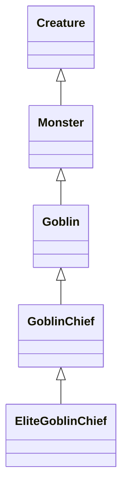
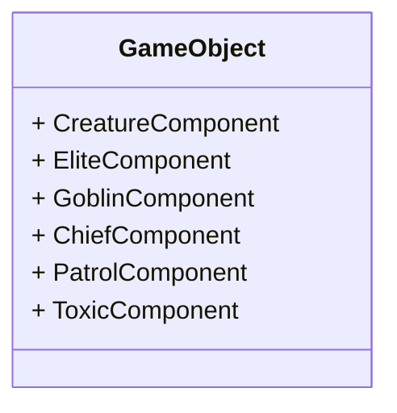

# Composition

As oppose to doing inheritance:


We should make use of Components and do composition


`PatrolComponent`
* maybe we want things to patrol in our game
* we could create a pathway, and then have the entity follow that pathway at a specific time
	* we can also make it so that we can set everything in Unity Editor
	* eg. set the patrol start points and end points, set a pause time every time it reaches the an end point
* we can give the `PatrolComponent` to anything in the scene
	* maybe we want the camera to patrol
		* then have that be the demo code for the begninning of the game

`EliteComponent`
* maybe if a certain enemy is an elite, it shines bright and drops more experience or something

`ChiefComponent`
* maybe has better weaponry

`ToxicComponent`
* maybe when an enemy dies, it sprays toxic gas or toxic liquid all over the place

The flexibility is insane
* any component to any object
* it's on us to implement all these components though
	* we get a lot of them for free, from Unity
	* ultimately though, we're gonna program our game logic, so we need to implement some
___

# MonoBehaviour

the name probably comes from because Unity originally is a Mac project and everything was implemented in Mono, eventually MonoBehaviour is just how it's scripted

A MonoBehaviours is essentially, what a component is
* they are one and the same
	* only MonoBehaviours is how it's illustrated in code

If we want to program something to be a component, to then attach to a game object
* it needs to be inherited from MonoBehaviour

Any component that have a name followed by a `(Script)`, it's a custom component
___

# Project Structure

Usually a Unity project have an `Assets/` folder
* we can create a `Resources/` folder under `Asset/`
	* this is not mandatory though, just a habit or convention
* inside of which, are some more folders like [[2-1 Organization#breakout-0: organization|how we did for Love2D games]]
	* so all our fonts, graphics, sounds, even scripts are there

> [!tip]
> Go to Unity > Preferences > External Tools > External Script Editor, to set the default IDE.
> * default is Visual Studio, but we can change it to VS Code, Atom, Sublime Text, ...
> 
> Starting in 2018, Unity is transitioning from its prior IDE, MonoDevelop, and making Visual Studio as the default IDE.

To create a component, or script:
Right click on the Project window > Create > C# Script
___

# eg. Coin component

First of all, every component, is a class
* actually, everything in C#, effectively is a class
	* just as in Java

Every component that we want to create and add to Unity, and to drive behavior of an object, needs to inherit from MonoBehaviour
* *MonoBehaviour is the base class from which every Unity script derives.*

By default, any newly created C# script will have a boilerplate written already
* inherit from MonoBehaviour, and
* have an empty `Start()` and `Update()` method

They don't have to be though
* we can create a class of our own, don't have to inherit from anything
	* maybe it's just representing a data structure or something

```c#
public class Coin : MonoBehaviour {  // : means extends or inherits
	
	// like the `init()` function for every class in our Love2D projects
	void Start () {
		
	}
	
	// like the `update()` function
	void Update() {
		if (transform.position.x < -25) {
		// if the coin gets outside of the left side of the screen
		Destroy(gameObject);
		}
		else {
			transform.Translate(...);
		}
		
		transform.Rotate(0, 5f, 0, Space.World);
	}
}
```

`void Start()`
* get called as soon as this component is instantiated

`void Update()`
* get called every frame
	* Unity will go through every component on every live game object
	* to call the `Update()` in each component

btw, `transform.Rotate(0, 5f, 0, Space.World)`
* `Space.World` means the rotation happens relative to the world space
* so the coin rotates on the world's y-axis, rather than its own y-axis

Just by assigning the component to a game object in the scene
* we get the Start, Update, etc., all the functionality, for free
* we don't need to call the function somewhere

`transform`
* the component that encapsulates the object's position, rotation, scale
* remember `-25` here is Unity units, or meters, but not pixels
	* because pixels aren't viable in 3D
* notice we didn't declare `transform` anywhere
	* because it's in the parent class `MonoBehaviour`
	* same goes for `gameObject`

`gameObject`
* the game object that this script or component belongs to

Every object in our game has components
* helicopter has `HeliController`
* coins has `CoinSpawner`
* `SkyscraperSpawner`
* `Skyscraper`
* ....
___

# Unity Docs - MonoBehaviour

[Unity User Manual](https://docs.unity3d.com/Manual/index.html)
* explained pretty much everything implemented in Unity
* in quite a good detail, with a lot of examples

[Unity - Scripting API: MonoBehaviour (unity3d.com)](https://docs.unity3d.com/ScriptReference/MonoBehaviour.html)
* It comes with a few major methods: `Start()`, `Update()`, `FixedUpdate()`, etc.
	* they are all optional though
* It also comes with Messages
	* a whole lot of them
	* they are functions that we can override
	* they get called when certain things happen in the game scene
		* eg. `OnTriggerEnter()`
			* if buildings in our game were triggers, and our helicopter entered it, we can call the helicopter's explode method
		* eg. `LateUpdate()` gets called after all `Update()` functions have been called
			* can be relevant for certain physics calculations
* We don't need to do everything ourselves
	* if Unity provides us with the function that gives us the effect that we're looking for
___

# Play mode

while in Play mode, we can pause the game
* so that we can analyse things
* see the values of all the fields in all the components on all the objects
* we can mess around the values to test or debug things

while the game is paused, we can step over frame by frame
* to see how the fields in components and how the objects change, in step time

when we exit Play mode, all our changes done in Play mode are reverted
* we don't need to revert the changes manually, they are just saved
* therefore we do need to remember how we've changed the fields if we fixed bugs in Play mode
	* so it can get disheartening or frustrating if we forget how we fix something....
___

# Console

like JavaScript for the web, we can output things to console using `console.log`
* in Unity it's `Debug.Log()` and then the output is on a Console window

sometimes the things that we want to look at are not necessarily can be seen in the Inspector
* eg. an algorithm or a generator, like a level generator, and we want to see if the data structure representing the level is generated properly, we can output everything in Console
	* maybe via hashmarks or something
	* rather than having to run through every level in the actual game to see if it's correct
* so something that is hard to model in the Editor, still needs Console output
___
