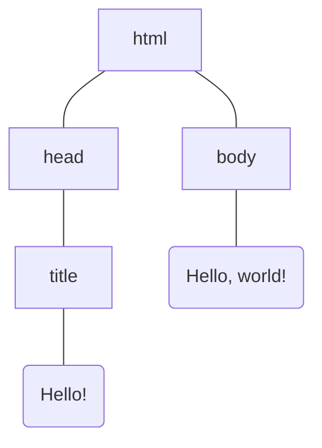

# HTML
Hyper Text Markup Language
a language to describe the structure of a web page

```html
<!DOCTYPE html>
<html lang="en">
	<head>
		<title>Hello!</title>
	</head>
	<body>
		Hello, world!
	</body>
</html>
```

`<!DOCTYPE html>`
* this is a `DOCTYPE` declaration
* it tells the web browser what version of HTML we're using in this particular web page
	* every version of HTML has different ways to indicate the version
	* ours here, means it's using HTML5, which is the latest version of HTML

The following are different nested HTML elements
* an HTML element describes something on the page
* we can have elements inside of elements
* each element is indicated by an HTML tag

`<html lang="en">`
* it means this is the beginning of the HTML content of the web page
* likewise, `</html>` means the end of the HTML content
* in between, is the actual HTML content of the page
	* which might include other HTML elements

`lang="en"` is an HTML attribute
* it is some additional information that we're giving about the HTML tag
* here `lang` means language, `"en"` means English
	* so it tells that the page is written in English
* why it is important? it is helpful for search engines, for example.

`<head>`
* the head section of a web page, describes some information about the page
	* these information are not in the main body, so it's not something users usually see
* why is it important? as the information is going to be helpful for web browsers to know about.
	* eg. what is the title of the web page?
	* so we give the page a title, using the `<title>` tag

`<body>`
* the visible part of the page that the user can see
___

## DOM
document object model

the way how HTML elements are structured, is kinda tree-like
So, we have a tree-like structure for representing a web page, DOM
* it describes how are the HTML elements of a page related to the others



when JavaScript comes into play, DOM is all the more powerful
* it gives us the ability to modify parts of the DOM
___

# Common HTML elements


## Heading

```html
<h1>This is a heading</h1>
<h2>The is a smaller heading</h2>
<h6>Smallest heading</h6>
```

For heading for the page, we would use `<h1>`
For headings for different sections and subsections, we would use the smaller headings


## List

HTML has 2 basic types of list,
* ordered list, 1, 2, 3, ......
* unordered list, bullet point, bullet point, bullet point, ....

```html
An Unordered List:
<ul>
	<li>One Item</li>
	<li>Another Item</li>
	<li>Yet Another Item</li>
</ul>
An Ordered List:
<ol>
	<li>First Item</li>
	<li>Second Item</li>
	<li>Third Item</li>
</ol>
```

`<ol>` for ordered list
`<ul>` for unordered list
`<li>` for list item


## Image

```html

```

`` has a couple of *required* attribute
* `src` for source
* `alt` for alternative text
	* a text-based representation of the image
		* to subsititude the image in case for some reason the image is not displaying
	* eg. maybe some web browser can't render the image correctly
		* due to some error
		* or slow internet connection
	* eg. or someone using a screen reader

* note that it doesn't have a closing tab
	* because `` is a single HTML element that can't really have anything inside of it
	* it is self-closing, it is its own beginning and end

* `width` is an additional attribute, it is not required
	* `"300"` means we want it to be 300 pixels wide


## Link

```html
<a href="https://google.com">Click Here</a>
<a href="image.html">Click Here</a>
```

`<a>` for anchor
* `href` for hyperlink reference


## Table
a table has rows, each row has cells

```html
<table>
	<thead>
		<tr>
			<th>Ocean</th>
			<th>Average Depth</th>
			<th>Maximum Depth</th>
		</tr>
	</thead>
	<tbody>
		<tr>
			<td>Pacific Ocean</td>
			<td>4,280 m</td>
			<td>10,911 m</td>
		<tr>
		<tr>
			<td>Atlantic Ocean</td>
			<td>3,646 m</td>
			<td>8,486 m</td>
		<tr>
	</tbody>
</table>
```

`<thead>` stands for the heading of the table
* the top row of the table, indicating what each column of the table means
* `<th>` again means heading

`<tr>` stands for table row
`<td>` for table data


## Form
Anytime users can provide input to a web page, we generally call that, a form.

```html
<form>
	<input type="text" placeholder="Full Name" name="name">
	<input type="submit">
</form>
```

The `<input>` tag comes with various `type`
* text input field, dropdown menu, radio button option, button, etc.
* in our case, we specified the input data type is of text

* `placeholder`'s string is what the user can see, so they know they should type their full name here
* `name` is not something that users see when they visit the page
	* anytime we submit a form, when the server receive the form, we need some way to know which input field corresponded to which value
	* so we just name each input field so later on we'll be able to reference them

`submit` input allows users to submit the form
* right now the form doesn't do anything, because we havn't added any logic to the web page


## Datalist

```html
<form>
	<div>
		<input name="name" type="text" placeholder="Name">
		<input name="password" type="password" placeholder="Password">
	</div>
	<div>
		Favorite color?
		<input name="color" type="radio" value="red"> Red
		<input name="color" type="radio" value="green"> Green
		<input name="color" type="radio" value="blue"> Blue
		<input name="color" type="radio" value="other"> Other
	</div>
	<div>
		<input name="country" list="countries" placeholder="Country">
		<datalist id="countries">
			<option value="Afghanistan">
			<option value="Albania">
			<option value="Algeria">
			<option value="Andorra">
			<option value="Angola">
			....
		</datalist>
	</div>
</form>
```

input type `"password"` will hide the actual characters being input to the field

`<datalist>` is a new feature from HTML5, it's a dropdown menu
* but users can very quickly filter down or autocomplete based on the options
* note that the `"country"` input is associated with a `list`, which is the datalist's `id`, `"countries"`
___
