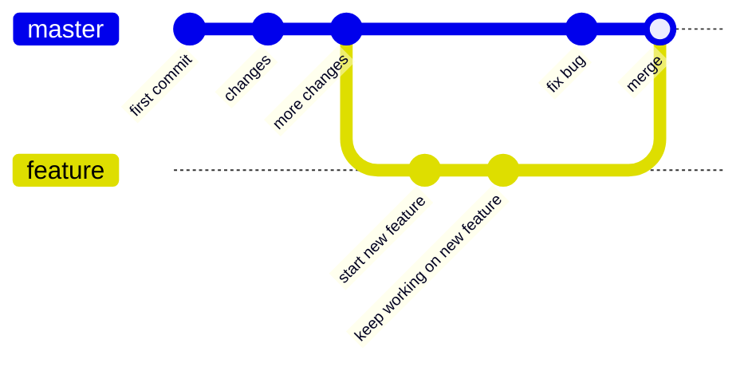

git is a version control tool. It allows
* keep track of changes to code
	* it saves snapshots of the files
* synchronizes code between different people
	* there is a *remote repository* online
	* developers can *push* and *pull* changes from it
* test changes to code without losing the original
	* we can have multiple *branches*
* revert back to old versions of code
___

# GitHub
GitHub is a website that holds repositories

1. go to https://github.com/new to create a new repository
* give it a name, description, access
* then click on create

2. right now, there is no file in the repository
* so GitHub is telling us to clone the repository and start making changes
___

# Git commands

3. `git clone` can take a repository from the Internet and download to our computer
* `git clone <url>`
* there are a couple of different ways that we can use to clone a repository
	* they are different ways to authenticate ourselves
	* either using HTTPS or SSH
		* HTTPS: using something like a username and password to authenticate
		* SSH: using something called SSH key

4. `git add` tells git to add a file or some files
* so later when we save, that is when we make a commit, it would take a snapshot of all these added files, so that later we can refer back to them
	* why need this 2 steps process? not every change we make is supposed to be saved
	* eg. we have 10 files, but we only finished 3 files. as for the other 7 files, we're still working on it so we don't want to save the unfinished states
* `git add <filename>`

5. `git commit` to save a snapshot of the added files
* usually use `git commit -m "message"`
* note that it saves locally, but not remotely
	* our GitHub remote respository is not affected

* there's a shorthand way to `git add` and `git commit`, which is `git commit -am <message>`
	* add all the changed files first, `-a` for all
	* then commit, also provide a commit message

6. `git status` allows us to see what is happening inside of our repository

7. `git push` allows us to push our changes to the remote repository

8. `git pull` to pull changes from remote

* `git log` to see all the commits in the past
	* along with their data and message

* `git reset` to revert back to an older state of the repository
	* `git reset --hard <commit>` to go back to a specific commit
		* eg. `git reset --hard 57656c6`
		* eg. `git reset --hard origin/master`
___

# Merge Conflicts

it happens when different people changed and commited the same lines at the same time (or commit time)
* so Git doesn't know what to do, what version to use
* also note that it implies that Git usually can automatically resolve merge conflicts
	* therefore people editing the same file at the same time is allowed
	* as long as they don't edit the same line

```
a = 1
<<<<< HEAD
b = 2   // Your changes
=====
b = 0   // Remote changes
>>>>>  57656c636f6d6520746f20576562   // hash of the commit that's causing the conflict
c = 3
d = 4
e = 5
```

to resolve a conflict, simply remove every unwanted things
* modify the changes in a way that everyone is happy with
* remove the merge conflict markers
___

# Branch
allows us to working on different part of the repository at the same time
* at any time though, we can only focus on one of the branches



the commit that we're on, or the current state of our local repository, is designated as `HEAD`
* by checkouting out a branch, we switch the `HEAD` to the other branch

then when we're happy with what we're doing in another branch, we can merge the branches
* using `git merge`


## related commands

`git branch` to see all the branches that our repository has

`git checkout <branch>` to switch to a branch
* `git checkout -b <branch>` to create a branch and switch to that branch altogether

`git merge <branch>` to merge branches
* it merges the `<branch>` to the current checkouted branch
* it can sometimes cause [[#Merge Conflicts|merge conflicts]] too
	* besides pulling from remote
___

# GitHub features

eg. bootstrap, https://github.com/twbs/bootstrap/
* it's an open-source project
	* meaning everyone can look at its code
	* and everyone can contribute to the project
		* it's not just one person, or one team, or one company, it's community-driven
* so if we want to contribute to it, how to do it?

1. Fork the repository
* which means making our own copy of the repository
* while bootstrap is public, it doesn't allow anyone to just push to it, because it'd be unsafe
	* meaning if we just do `git clone` then we probably can't ever run `git push`

2. so we need to copy the repository to our own, by forking, and make changes to it

3. then when we'd like to contribute to bootstrap, we need to open a *pull request*
* meaning we're requesting bootstrap to pull our changes

4. then the people who maintain the bootstrap repository can review those pull requests, provide feedbacks, ask for additional changes, etc.
* then when they're satisfied, they can merge those changes to their repository

So this is one of the key benefits of open-source software
* everyone can contribute
___

## GitHub Pages

GitHub provides a free way to deploy web pages to the Internet, for anyone to look at
* any GitHub user is allowed to create a GitHub Pages website for free

`USERNAME.github.io` is the conventional repository name of a user's GitHub Pages
* so if we name our repository this way, GitHub knows to make it a GitHub Pages

by setting a repository as GitHub Pages, it'd provide a link for us to visit the web page
* eg. https://USERNAME.github.io
* then, anyone can visit the website to see our GitHub Pages

The advantage is that it's very easy to update the website
* we just need to push the changes to the repository
___
