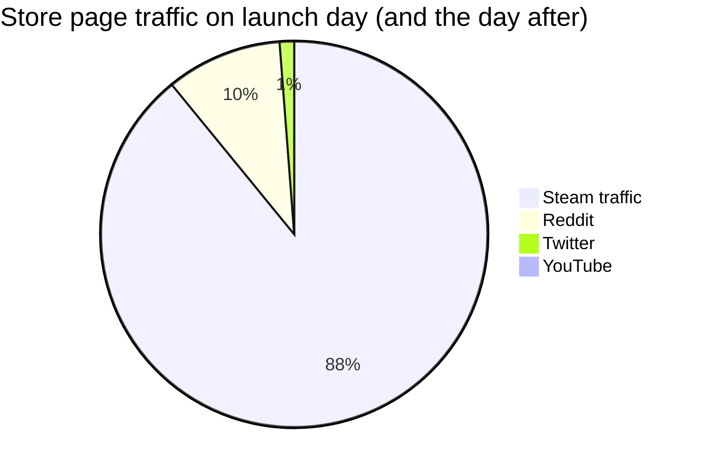

[No Time, No Budget, No Problem: Finishing The First Tree](https://www.youtube.com/watch?v=g5f7yixtQPc)
by David Wehle

He finished The First Tree, while working full time
* as a technical artist at a VR company, The Void
* as a father
* without very much money

The First Tree
launched Sept. 14, 2017 on Steam
| Costs | Time | Gross Revenue |
| :-: | :-: | :-: |
| $10,250 | 18 months of nights and weekends | ~$150,000 (first year) |

money is spent on
* website
* music
* .....
___

# Reddit

got on reddit's front page when the game launched
* 3 million views on his GIF, after 2 days
* over 200k Steam page visits

when the console version came out, he did it again

Why it did so well?
* luck
* consistent posting every where over 18 months
	* some did great, some didn't
	* basically it's how you eat an elephant, one bite at a time
___

# Home is where one Starts
this is his last game before The First Tree

it was a first-person exploration game
* made mostly just Unity assets, and PlayMaker
* made $15,000 in revenue
	* through a lot of bundles, and extreme discounts

but he did things wrong
* launched at midnight
* changed the launch date last minute
* no one covered the game on day one
	* no journalists or streamers or YouTubers
* no email list, only 200 Twitter followers
* no popularly requested features for Steam
	* no trading cards, subtitles, localization, ....
	* he waited to patch in later
___

# The First Tree story
He called it the *Low-time / High-impact strategies*

It means
* you don't have a lot of time
	* you need to be as productive as possible
* you try to take that risk of making a high impact
	* yes it's risky

* note that the game takes 2 hours to complete
___

## Low-Time / High Impact Development

1. Find time
2. Asset Store
3. Never have a 0% day

**Typical Weekday**
8 hour work > 45 minutes game dev > Family Time > 1-2 hours game dev in the evening
= 10 hours a week
* there were sacrifices
	* probably no play time, no movie time
	* Family Time usually is YouTube

Asset Store and license assets save your time
* he estimated it saved him roughly 600 hours
* you need to spend some money, but still it's very cheap compared to hiring someone
* usually you'd change or twist the assets you got a little
* additionally, it helps the people who helped you

Never have a 0% day
* you do will burn out, then just do some other things
	* do the 1%, do some small wins
	* it encourages you to do the harder stuff that you hate
* eg. answering an email, doing a small color change, ....
* work on the game every single day

but there are cons
* compromised vision, you don't get to make it your dream game
	* it's just you, after all
	* it's gonna be short, his was 1-2 hours long
	* and it's cheap, his was $8 on Steam when it came out
* recognizable stock assets
	* you're using others assets after all
	* at least you can try to make it your own
	* be careful some music would get YouTube video flagged, so that would make content creators a little upset
* extremely messy project
	* just... try not to be that messy

There is this one pro though, that is
You finished your game!
* you got yourself a presentable game
	* maybe not perfect, but presentable
___

## Marketing in Social Media

A typical week
* 70% development
* 30% marketing

A typical marketing
1. make GIF
2. post GIF
3. repeat

Usually shared on
* Twitter
	* use hashtags, like Screenshot Saturday and Made with Unity on Friday
	* if Unity retweeted you, you're doing well
* Tumblr
	* again, use hashtags
* Reddit
	* r/gamedev, r/ScreenshotSaturday

Make your trailer, as soon as possible
Create your website, as soon as possible

Create your Steam page
* with tags, so you can those organic wish lists

So it's basically just a long time of drop by drop accumulation
___

## Low-Time/High-Impact Marketing

1. Find your hook before development
2. "Visuals-first" development (gifs only!)
3. Social media blitz on launch

if you show some original thing to others, people don't know how to react to it
if you combine popular things and combine them together, people would love it

He didn't market the game as this original game named The First Tree
Instead, he marketed it as the game Journey, but the Fox Edition
* kinda lucky on that marketing idea that someone else thought of for him
* people love Journey, some people love everything that got fox in it

> [!tip]
> it's good to remind gamers of things that they love

**Visual-first development took priority**
* get GIFs as soon as possible, so you can market the game

* get your website, trailer, Steam page, up, ASAP
* GIFs were shared 10x more than screenshots
	* maybe even don't waste time on screenshots
* Ooblets followed this principal to great success

* It gives you data
	* what game ideas, what scenes, resonate best with people
	* then you know you need to put these in your trailer, making it really a killer trailer

**Getting on New and Trending**

the plan was:
Email list + wishlist + Social media blitz = New and Trending tab
* you need to get on the Steam front page
* you need to please the algorithm god
* you need enough day one purchases, and even the first hour purchases

why you need to get on the Steam front page?
because the amount of traffic is insane.

A data scientist analyzed a lot of the top reddit posts as well
* usually time is involved
	* eg. "I've been working on my game for 3 years"
* or there's a motion in the title
	* eg. "for people who hate golf!"
	* to catch people attention

* generally, not a tone like a sales guy trying to sell his product, but like a friend showing something that you're very proud of

Also, post not just Reddit, but also a lot of other places
* eg. Imgur
	* a lot of those didn't go well, but a few did get on the front page
	* helps building up wishlist and email list

Example of good Reddit posts, from The First Tree
* "As a kid I always dreamed of releasing a game on a Nintendo console... today it happened!"
* "After 2 years of work and no knowledge of code, I still launched my fox adventure game today, The First Tree!"
* "Doesn't seem like much, but getting footprints working in my game is huge for me \[The First Tree]"
* "Stress testing bunny herds in a game (with unforeseen consequences)"

Example of not so good Reddit posts
* "The First Tree launch trailer (releasing on Steam September 14)"
* "Super fox! \[The First Tree]"
* "Points of light towards The First Tree"

Probably no post that links to a store page or even a website,
so always links to a GIF

Generally, bad posts are too vague, or not connecting with people
* in addition, this is things that indie get to do but AAA doesn't
* ie. you're like a friend next door making a game
	* you're not a company with the PR department
* so people can put themselves in your shoes
	* "oh, he made a game, that's my dream!"
	* they kinda want to celebrate with you too

Also in the comment, you can have a call to action
* just one link to your store page
* if you link to too many store pages, your comments might get removed
	* because it wreaked of self promotion

However, be careful with the Reddit's self-promotional rules
* only 10% of submissions can be about your project
	* comments don't count
* so post some normal things regularly, so that you're legal

Surely, you need people to your email list some where
* probably in your website
* you can your dedicated fans there

This is The First Tree's social media traffic
![[The-First-Tree-traffic.png]]

When it was launched, 2017
* 12,000 Steam wishlists
* 4,700 Twitter followers
* 4,400 mailing list subscribers
* 1,300 Tumblr followers
* 100,000 views on YouTube trailer

finally,
* 11,000 sales, first week
	* that was 7% conversion rate of his wish list
	* factors include an additional 50,000 wish list for being on Steam's front page, for 5 days

When your game launches, don't do anything except screaming for more attention
All the marketing works, are for getting on Steam's New and Trending tab

### If Reddit post failed
* mailing list helped the most any way
* use smaller subreddits
	* eg. r/Unity3D, r/pcgaming, r/indiegaming
	* to drive traffic
* keep at posting
___
